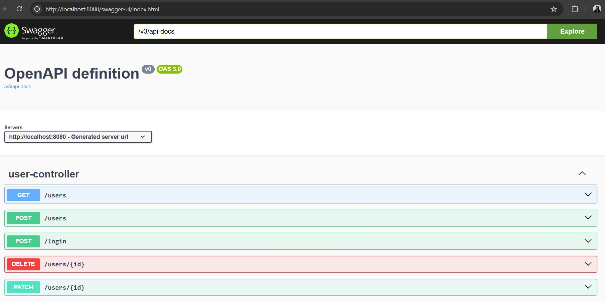
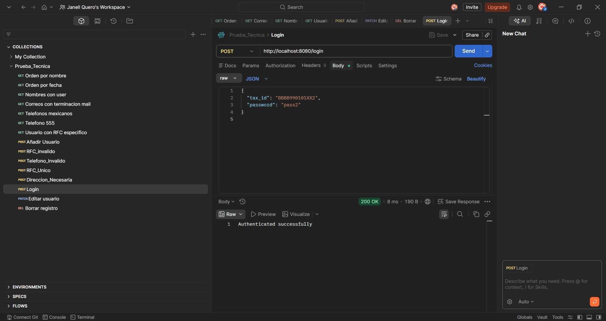

# 🚀 Prueba Técnica: API REST de Gestión de Usuarios

La API permite la gestión de usuarios, integrando seguridad, validaciones personalizadas y documentación automatizada.

---

## 🛠️ Tecnologías y Versiones
*   **Lenguaje:** Java 17 (Amazon Corretto / Eclipse Temurin)
*   **Framework:** Spring Boot 3.2.4
*   **Documentación:** SpringDoc OpenAPI 2.1.0 (Swagger UI)
*   **Gestor de Dependencias:** Maven 3.9.14 (vía Maven Wrapper)
*   **Contenedorización:** Docker 🐳
*   **Seguridad:** Encriptación de credenciales integrada.

---
## 📂 Estructura del Proyecto

El proyecto sigue una organización por capas para facilitar el mantenimiento y la escalabilidad:

```text
src/main/java/com/example/prueba_tecnica/
├── controller/
│   └── UserController.java          # Endpoints de la API REST.
├── exception/
│   └── GlobalExceptionHandler.java   # Captura y formato de errores específicos (RFC).
├── model/
│   ├── Address.java                 # Entidad/Objeto de dirección.
│   ├── LoginRequest.java            # DTO para autenticación.
│   └── User.java                    # Entidad principal de Usuario.
├── service/
│   └── UserService.java             # Lógica de negocio y procesamiento de datos.
├── util/
│   └── EncryptionUtil.java          # Utilidad para la encriptación de contraseñas.
└── PruebaTecnicaApplication.java    # Clase principal de arranque.

src/test/java/
└── com.example.prueba_tecnica/
    └── PruebaTecnicaApplicationTests # Pruebas unitarias y de integración.
```
---
## 💡 Decisiones de Arquitectura e Implementación

Para garantizar la escalabilidad y robustez del sistema, se aplicaron los siguientes criterios técnicos y de negocio:

---


### 1. 🏗️ Arquitectura y Persistencia
*   **Diseño en Capas:** Se implementó el patrón **Controller-Service-Repository**. Esta separación de responsabilidades asegura que la lógica de negocio esté aislada de la entrada de datos y del acceso a la base de datos.
*   **Base de Datos H2 (In-Memory):** Se configuró una base de datos en memoria para permitir la **ejecución inmediata** del proyecto. El evaluador no necesita configurar servidores externos; basta con ejecutar la aplicación para que el esquema se cree automáticamente.
*   **Validación de Datos y Reglas de Negocio:** Uso de `jakarta.validation` para interceptar datos incorrectos antes de la persistencia:
    *   **Direcciones Diferenciadas:** Se estableció que la **dirección de casa sea obligatoria**, garantizando un punto de contacto base para el usuario, mientras que la **dirección de trabajo es opcional**, brindando flexibilidad para perfiles laborales independientes o desempleados.
    *   **Formatos Estrictos:** Validación de mayoría de edad, estructura de email y campos requeridos para asegurar la integridad de cada registro.

---

### 2. 🌍 Gestión de Tiempos (Caso Madagascar)
*   **Integridad vs. Formato:** Aunque el requerimiento pedía precisión hasta minutos, el sistema **almacena los segundos** internamente. Esto previene la pérdida de precisión histórica, mientras que la salida (output) se formatea estrictamente según lo solicitado.
*   **Resiliencia Horaria:** La visualización se configuró en **UTC referenciando a Antananarivo**. Esta decisión técnica garantiza que, ante cualquier cambio geopolítico en el huso horario de Madagascar, la referencia geográfica permanezca constante y rastreable.

---

### 3. 🔍 Lógica de Filtrado Inteligente (Teléfonos)
Se detectó que los registros internacionales inician con el carácter `+` (codificado como `%2B` en solicitudes URL). Se implementó una lógica dual:

| Caso de Uso | Prefijo      | Comportamiento |
| :--- |:-------------| :--- |
| **Búsqueda por Lada** | `+` (`%2B`)  | El sistema filtra priorizando el código de país (ej. `+52`). |
| **Búsqueda General** | Solo números | El sistema busca coincidencias en cualquier parte del número local. |

> **Ejemplo:** La búsqueda `sw+%2B52` filtrará usuarios con la lada de México, mientras que `sw+555` buscará el patrón "555" al inicio pero sin considerar el prefijo internacional.

---

### 4. 🛡️ Seguridad y Manejo de Errores
*   **Protección de Credenciales:** Se implementó la **encriptación de contraseñas** antes de la persistencia. Nunca se almacena información sensible en texto plano en la base de datos.
*   **Manejo Global de Excepciones:** Mediante `@RestControllerAdvice`, se estandarizaron las respuestas de error (400, 404, 500) en formato JSON.
*   **Mensajes con Identidad:** Los errores no son genéricos; el sistema devuelve descripciones específicas (ej. errores de formato en RFC), facilitando la integración con el Front-End o clientes externos.

---

## 🔍 Endpoints Principales

| Método | Endpoint | Descripción |
| :--- | :--- | :--- |
| GET | `/users` | Listar todos los usuarios. |
| POST | `/users` | Crear un nuevo usuario. |
| GET | `/users/{id}` | Obtener detalle de un usuario específico. |
| PATCH | `/users/{id}` | Actualización parcial de un usuario (solo campos enviados). |
| DELETE | `/users/{id}` | Eliminar un usuario del sistema. |


## 📖 Documentación Interactiva (Swagger)
Una vez que la aplicación esté en ejecución, puedes acceder a la interfaz de Swagger para probar los endpoints:

👉 [http://localhost:8080/swagger-ui/index.html](http://localhost:8080/swagger-ui/index.html)

> **Nota:** Se ha incluido el contrato de la API en la raíz del proyecto como `OpenApi.json` para facilitar su importación en herramientas como Postman.

---


## 🐳 Ejecución con Docker

Para desplegar la aplicación en un contenedor, asegúrate de tener Docker Desktop iniciado y sigue estos pasos en la terminal:

1.  **Generar el ejecutable:**
    ```bash
    ./mvnw clean package
    ```
2.  **Construir la imagen:**
    ```bash
    docker build -t nombre_raiz .
    ```
3.  **Iniciar el contenedor:**
    ```bash
    docker run -p 8080:8080 nombre_raiz
    ```

---
-----

## 📸 Evidencia de Funcionamiento 

Para validar el correcto funcionamiento de la API, se realizaron pruebas exhaustivas utilizando Postman. A continuación, se muestra una captura de pantalla de una petición exitosa:



*Descripción: Validación de un endpoint (ej. Registro/Login) devolviendo un estatus **200 OK** y la respuesta en formato JSON, confirmando la correcta integración de la lógica de negocio, validaciones y encriptación.*

-----

## 🚀 Roadmap y Futuras Mejoras

Debido al tiempo limitado de la prueba técnica, se identificaron los siguientes puntos de mejora para una fase productiva:

*   **Gestión de Secretos:** Mover la `SECRET_KEY` del archivo de configuración hacia un **Vault** o variables de entorno del servidor.
*   **Reglas de Unicidad:** Implementar validaciones únicas para campos como `email` y `teléfono` para evitar cuentas duplicadas.
*   **Personalización por Negocio:** Adaptar reglas de validación específicas según el plan de negocio contratado (formatos de teléfono por país, etc.). La viabilidad técnica ya fue demostrada en las validaciones actuales; su expansión es una tarea puramente iterativa.

---

> **Observación Final:** Este proyecto fue diseñado bajo principios de **código limpio (Clean Code)** y escalabilidad, permitiendo que la lógica de negocio crezca sin comprometer la estabilidad de los servicios existentes.
